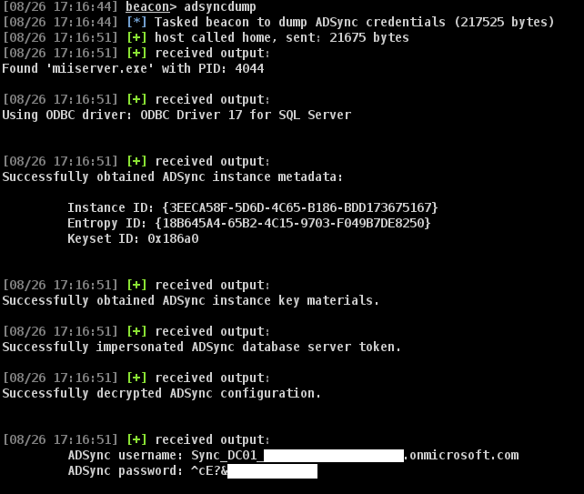
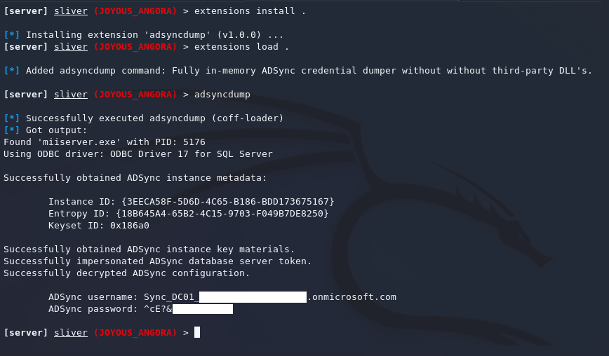

# ADSyncDump BOF

The ADSyncDump BOF is a port of Dirkjan Mollema's [adconnectdump.py / ADSyncDecrypt](https://github.com/dirkjanm/adconnectdump) into a Beacon Object File (BOF) for use with Cobalt Strike, Sliver and Havoc.

> [!NOTE]
> The tool has been tested on a Windows Server 2019 with Azure AD Connect version `2.2.1.0`. The 32 bit version of the BOF is untested, but I included it for completeness sake. Use at your own risk.

## Compilation

To compile the BOF, simply run `make` in the directory containing the source code. This will generate both 32-bit and 64-bit versions of the BOF.

```shell
make
```

## Usage

On Cobalt Strike, load the `adsyncdump.cna` script, for Sliver, use the `extension install` and `extension load` command to install the BOF. Once installed, laterally move to the AD Sync server as `NT AUTHORITY\SYSTEM` and run the `adsyncdump` command:

```shell
beacon> adsyncdump
```





## Background

This BOF came into existence a couple of years ago during an engagement after I ran into issues with the fact that the original Python script was too intrusive on client systems, and I had trouble getting the .NET version to run properly. As such I decided to reverse engineer the exact Win32 API calls used for the decryption process in my spare time and port it to a BOF.

Originally, I didn't plan to share this project due to the fact I felt doing so was irresponsible, given that the ADSync account held some absurd privileges, and detection of the existing tooling wasn't great. However, since then, the privileges of the ADSync account have been severely limited by Microsoft, making the impact less severe (still not great, but at least you can't edit conditional access policies anymore[^wtf-microsoft]).

In addition, given that other researchers have already published the information about the inner workings of the decryption process (lots of props to Dr Syynimaa[^aadinternals] and Dirkjan Mollema[^dirk-jan]), and the fact that detection has become more widespread, I now feel more comfortable sharing this BOF with the rest of the community (sorry for being late to the party).

## License

This project is licensed under the MIT License - see the [LICENSE](LICENSE.md) file for details. I take no responsibility for any misuse or damages caused by the use of this tool. Only use it in environments where you have explicit permission to do so.

[^wtf-microsoft]: <https://x.com/_dirkjan/status/1715263925971821008>
[^aadinternals]: <https://aadinternals.com/post/adsync/>
[^dirk-jan]: <https://dirkjanm.io/updating-adconnectdump-a-journey-into-dpapi/>
